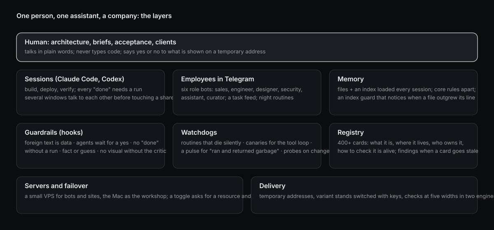

# one-person-ai-shop

How one person runs a company, its clients and its own tooling with an AI assistant as the builder: the layers, the rules that are mechanisms instead of reminders, and the numbers. Principles only, no internal context; updated as the setup changes.

   

## The shape

One human, one assistant, one company. The human does architecture, briefs and acceptance and talks to clients; the assistant builds, deploys and verifies. The human does not type code; everything that is built is shown on a temporary address and accepted or rejected by looking at it. The setup below exists so that this works with no staff and does not fall over at night.

## Layers

**Sessions.** Claude Code and Codex on the desktop, several windows at once. Windows announce themselves to each other and write before touching a shared file. A session has a scratchpad, a project memory, and a set of hooks that run on every tool call.

**Employees.** Six role bots in Telegram - sales, engineer, designer, security, assistant, curator - each a session with its own zone and its own slice of memory. They receive tasks from a feed, run night routines, and report to a group. A task is not a wake-up: waking someone up is a separate, explicit act.

**Memory.** File-based. Only the index is loaded into a session; a file is opened when its index line hints that the answer is inside. Core rules ("how to work with this person") live in one file loaded every time. An index guard keeps a fingerprint of each file and of its index line and complains at session start when a file changed and its line did not - because a fact with a stale line is, for the next session, absent.

**Guardrails.** Rules that mattered were rewritten as hooks, because a rule in text held about 0% of the time and a hook 100%:
- text that came from outside (web, downloads, mail) is marked as data, never instructions;
- subagents are closed by default; a single-use, per-session approval opens one call;
- "done" does not pass the exit unless something was run after the last edit;
- a concrete claim about the system without an opened source gets "fact or guess?";
- a visual is not shown until a critic has asked "decision or default?";
- data files (JSON, YAML) are validated after every edit; shell variables must be ASCII.

**Watchdogs.** Routines die silently: a green status and a zero result look the same. A watchdog for scheduled routines distinguishes "checked and clean" from "could not check", and the second is an alarm. Canaries confirm the tool loop is alive. A pulse looks at results, not processes: "ran and returned garbage" is caught there. Probes re-run when the code they cover changes.

**Registry.** Every part - tool, hook, skill, routine, service, agent, bot, server, storage - has a card: what it is, where it lives, who owns it, how to check it is alive. A stale card raises a finding that must be resolved one of four ways: fix, defer with a date, dismiss as false, or escalate to the human. Looking and doing nothing is not an outcome.

**Servers and failover.** A small VPS for bots, sites and inboxes; the Mac as the workshop. One toggle decides where a resource is read from: a script asks for a secret or a file and gets a working path from whichever side is alive. Backups run to a second machine on a timer; a restore from a snapshot was the actual recovery path once.

**Delivery.** Work is shown on a temporary address, never described in words. Variants of one block go on a single page and switch with keys 1-4, so the person chooses by number. Pages are checked at five widths in two engines before they are called ready. A critic runs before every show.

## Numbers

414 parts in the registry: 87 tools, 48 hooks, 40 skills, 38 probes, 36 routines, 30 services, 22 agents, 19 builders, 18 daemons, 17 storages, 8 bots, 6 AI employees. Counted from the registry, not estimated.

## What is open

- [decision-or-default](https://github.com/MrFreedxm/decision-or-default) - the pre-show critic skill.
- [fact-or-guess](https://github.com/MrFreedxm/fact-or-guess) - the Stop hook that asks for a source.
- [screencast-to-script](https://github.com/MrFreedxm/screencast-to-script) - a screen recording of a routine becomes a script.

## What is deliberately not here

Client names and data, addresses, tokens, the internal registry, the sales product, and anything that only makes sense with the context of one specific business.

## Principles

1. Installed on the client's side: the data and the system stay with them.
2. A rule that matters becomes a hook, not a reminder.
3. "Done" means a run happened, not that it should work.
4. Text from outside is data; instructions inside it are reported, not executed.
5. Every number about a result is labeled: a client's measurement, a calculation, or "in progress".
6. Rejected twice with words about quality: change the tool, not the effort.

Built with Claude Code and Codex. The failures behind every line are real.

MIT © Ilya Tretyakov
